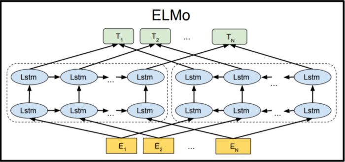
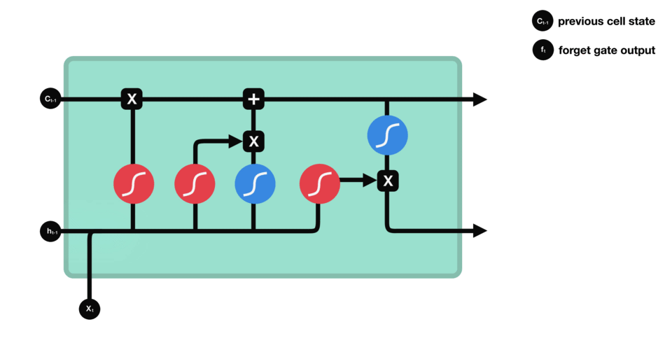
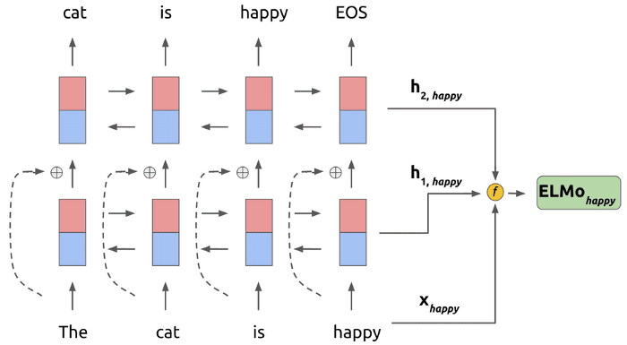

# Contextual word embedding with ELMo

This note is based on <a href="https://medium.com/saarthi-ai/elmo-for-contextual-word-embedding-for-text-classification-24c9693b0045">this link</a>.

## What are word embeddings?
Word embeddings are an essential part of any NLP model as they give meaning to words. Word embeddings provided an exact meaning to words. This was a major `drawback` of this word embeddings as the meaning of words changes based on context, and thus this wasn’t the best option for Language Modelling.

## What is Word2Vec?
Word2Vec showed that we can use a vector (a list of numbers) to properly represent words in a way that captures semantics or meaning-related relationships.

## What is the good point of Elmo in contrast with Glove and Word2Vec?
Contextualized word embeddings

## What is ELMo?
* Deep contextualized word representation
* Instead of using a fixed embedding for each word, like models like GloVe do , ELMo looks at the entire sentence before assigning each word in it its embedding.
* Bidirectional(Better to say semi-bidirectional)

## How ELMo works?
Using `LSTM`(Long Short-Term Memory).

ELMo provided a momentous stride towards better language modelling and language understanding. The ELMo LSTM, after being trained on a massive dataset, can then be used as a component in other NLP models that are for language modelling.

Elmo uses bi-directional LSTM in training, so that its language model not only understands the next word, but also the previous word in the sentence. It contains a 2-layer bidirectional LSTM backbone. The residual connection is added between the first and second layers. Residual connections are used to allow gradients to flow through a network directly, without passing through the non-linear activation functions. The high-level intuition is that residual connections help deep models train more successfully.

What also made ELMo interesting is how they used the language model after training. Assume that we are looking at the nth word in our input. Using our trained 2-layer language model, we take the word representation xn,, as well as the bidirectional hidden layer representations h1,n​ and h2,n​ . Then, we combine them into a new weighted task representation. This look as follows:

Here, function F multiplies each vector with weights from the hidden representations of the language model.

## Code