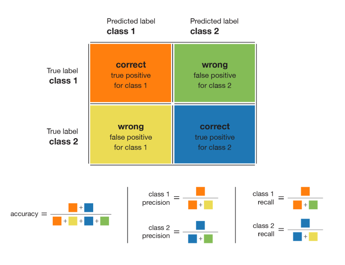

# Handling imbalanced datasets

## Metrics to determine imbalanced dataset

### Precision, Accuracy, Recall, and F1
A good and yet simple metric that should always be used when dealing with classification problem is the confusion matrix. This metric gives an interesting overview of how well a model is doing. Thus, it is a great starting point for any classification model evaluation.

The following are the different combinations of recall and precision for a particular class: 

* high recall + high precision : the class is perfectly handled by the model

* low recall + high precision : the model can’t detect the class well but is highly trustable when it does

* high recall + low precision : the class is well detected but the model also include points of other classes in it

* low recall + low precision : the class is poorly handled by the model

Let's check this for our `RoBERTa` model.

| tp | 7   |
|----|-----|
| fp | 2   |
| tn | 591 |
| fn | 114 |

* accuracy = (TP+TN)/(TP+FP+FN+TN) = 0.83
* precision = TP/(TP+FP) = 0.77
* recall = TP/(TP+FN) = 0.05
* F1 = 2*(Recall * Precision) / (Recall + Precision) = 0.09

As we have high precision and low recall, out model can't detect the class well but is highly trustable when it does.

### ROC and AUROC
Suppose that for a given point x, we have a model that outputs the probability that this point belongs to C: P(C | x). Based on this probability, we can define a decision rule that consists in saying that x belongs to class C if and only if P(C | x)≥T, where T is a given threshold defining our decision rule. If T=1, a point is labelled as belonging to C only if the model is 100% confident it does.

Based on the ROC curve, we can build another metric, easier to use, to evaluate the model: the AUROC which is the Area Under the ROC curve. AUROC acts a little bit as a scalar value that summarises the entire ROC curve. As it can be seen, the AUROC tend towards 1.0 for the best case and towards 0.5 for the worst case.
Here again, a good AUROC score means that the model we are evaluating does not sacrifice a lot of precision to get a good recall on the observed class (often the minority class).

## Solutions
To begin, the first possible reaction when confronted with an imbalanced dataset is to assume that the data are not representative of reality: if this is the case, we assume that real data are nearly balanced but that the collected data has a proportions bias (due to the gathering method, for example).
In this instance, it's almost a given that more representative data be collected. 

### Undersampling, oversampling and generating synthetic data
These approaches are frequently promoted as excellent ways to balance a dataset before applying a classifier. 

* undersampling consists in sampling from the majority class in order to keep only a part of these points
* oversampling consists in replicating some points from the minority class in order to increase its cardinality
* generating synthetic data consists in creating new synthetic points from the minority class (see SMOTE method for example) to increase its cardinality